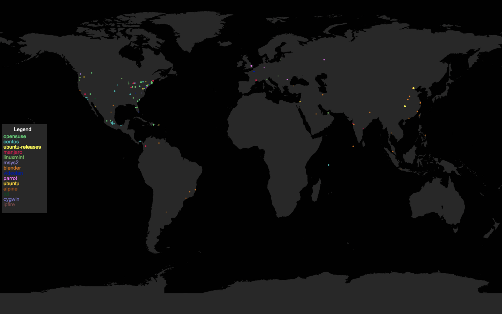

# MirrorMap

## This Project will be converted to this [repository](https://github.com/COSI-Lab/Mirror). Updates will no longer continue on here

This program parses the [NGINX](https://nginx.org/en/) access logs of [mirror.clarkson.edu](https://mirror.clarkson.edu), extracts geoip information, and streams data to clients over websockets.

## GeoLite2 Attribution

This software includes GeoLite2 data created by MaxMind, available from [www.maxmind.com](https://www.maxmind.com)

## NGNIX Log Format

This must be the formatting for your NGNIX Logs if you wish for this tool to work
"$remote_addr" "$time_local" "$request" "$status" "$body_bytes_sent" "$request_length" "$http_user_agent";
